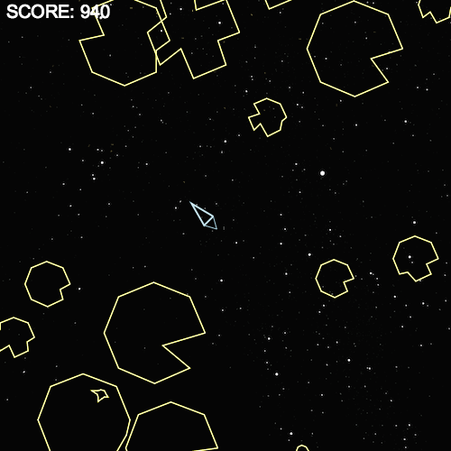

Asteroids
=========
###HTML5, Javascript, OOP, Canvas

The classic game of asteroids is brought back through the power of Javascript and the HTML5 canvas.

The player controls a spaceship that can fire lasers at moving asteroids, while also trying to avoid colliding into them.

###Controls
+ up-arrow - move forward
+ left-arrow - rotate left
+ right-arrow - rotate right
+ spacebar - fire laser

###Notable Code
+ Randomly generated asteroid shapes
+ Ship Movement based on Velocity Vector
+ Asteroids removed when off screen 

###Exciting Features
+ Retro graphics
+ Ship explodes upon impact
+ Asteroids explode upon destruction
+ Ship warps to opposite side when exiting side 
+ Rotational Steering
+ Ship propulsion effect
+ Drift

##Future Features
+ Collisions between asteroids
+ Limit rate of fire
+ UFO enemies
+ Random background
+ More balanced speed incrementation
+ Buttons to allow user to change game settings
+ Hyperjump - move ship to random position
+ Sound
